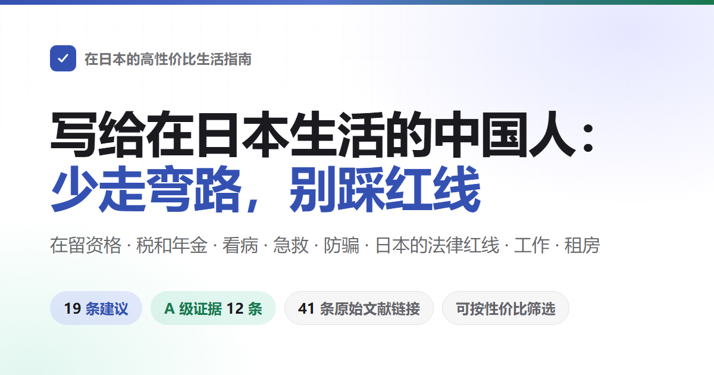

<div align="center">



# 在日本的高性价比生活指南

写给在日本生活的中国人。讲在留资格怎么不出问题，税和年金怎么交、怎么拿回来，看病怎么少花钱，出了意外怎么救。也讲哪些事在日本会让人被骗、被抓、被取消在留资格。<br>
19 条建议，每条写明花掉什么、换回什么、证据有多硬，来源只引期刊论文和官方文件。

本书改编自 [eternity4719](https://github.com/eternity4719) 的[《高性价比人生指南》](https://github.com/eternity4719/HowToLiveBetter)。算账方式和医学部分沿用原书，法律和制度部分按日本现行规定重写。

[](#目录)
[](#证据分级)
[](docs/核实记录/)
[](#许可)

### [打开在线检索页](https://masteren.github.io/HowToLiveBetter-JP/)

</div>

> 本书还在写，目前只有试点的三节，写完的是第 1 节（不要早死）和第 2 节（在留资格）。日本的入管和社保政策变得快，每条都写了截至日期，办事前请再查一次官方页面。

---

## 这本书想回答的问题

| 问题 | 去哪看 |
| --- | --- |
| 几乎不花钱，就能明显降低在日本意外早死概率的事有哪些？ | [1. 不要早死](book/01-不要早死.md) |
| 搬家、换工作、离职、回国一段时间，在留资格要报什么、什么时候会被取消？ | [2. 在留资格：别让签证出问题](book/02-在留资格.md) |
| 有人倒地、大出血、地震、台风，先做什么，打哪个电话？ | [3. 紧急情况：先做什么](book/03-紧急情况.md) |

## 怎么读

- **不用全做**：这是一份按性价比排好的备选单，不是任务清单。挑走一两条就算数，剩下的放着，需要时再回来查。
- **想按条件挑**：打开[在线检索页](https://masteren.github.io/HowToLiveBetter-JP/)，可以按关键词、章节、证据等级来筛，也可以按「花不花钱、花多少时间、要不要毅力」这三样筛，几个条件能叠着用。
- **日文名词照原样留着**：在留卡、住民票这类词，正文先写中文，括号里带日文原名，比如「在留卡（在留カード）」。去窗口办事、上网查的时候，用括号里的原名。
- **看不懂那串数字**：每条都有一行「说人话」，把「收益」栏里研究的写法翻成日常说法，不添新数字。只看这一行就够拿主意。
- **只想看结论最硬的**：在检索页里勾选证据等级 A，只留下有具体数字、来自荟萃分析或大型试验的 12 条。
- **只想看最值得做的**：勾选性价比「极高」，得到 7 条既不花钱、不花时间、不需要毅力，收益又落在最大一档的条目。

每条建议长这样（示例取自原书）：

```markdown
### 5. 把家里的食盐换成低钠盐（钾盐）
- 成本：一袋比普通盐贵几元。买的时候顺手换，不额外占时间。口味几乎不变。
- 说人话：两万人的随机试验里，把家里的盐换成低钠盐的人，五年内死亡的概率低约 12%，中风低约 14%。
- 收益：一项把人随机分成两组的试验，20995 人，跟踪了 4.74 年。用低钠盐的那组比用普通盐的那组，死亡风险低约 12%（RR 0.88）。卒中低约 14%（RR 0.86）。
- 证据等级：A
- 来源：Neal B 等 (2021). Effect of Salt Substitution on Cardiovascular Events and Death. NEJM. https://doi.org/10.1056/NEJMoa2105675
- 备注：争议。试验对象是高危老人，健康年轻人换盐得到的好处要小得多。肾功能不全的人，或者正在吃保钾类药物的人，换盐前先问医生。
```

## 四种资源

这本书想帮你多留住四样东西：

- **寿命**：活得更久，少死于本来可以避免的事
- **时间与精力**：少跑冤枉路，少在窗口之间来回折腾
- **金钱**：少花冤枉钱，该领的钱、该退的钱拿到手
- **人身自由**：不因为不知道一条红线，被逮捕、被取消在留资格、被遣返

每一条建议都回答两个问题：要花掉什么（钱/时间/精力/毅力），能换回什么（总死亡率变化 / 特定死因下降 / 时间与精力节省 / 金钱节省 / 保障与人身自由）。条目按性价比排，不按类别排。

**一条建议的好处落在谁身上，是分档的。** 按「这份好处将来有多大可能回到你自己身上」从高到低：① **你自己**；② **配偶和直系亲属**，包括留在国内的父母和孩子；③ **朋友、同事和其他亲属**；④ **陌生人**。不同档不合并计算，写到第 ④ 档时好处和风险一起写。

死亡率的数字、时间精力的数字、金钱的数字和法律后果，各算各的，不互相折算。

## 证据分级

每条建议都标注证据等级：

| 等级 | 含义 |
| --- | --- |
| A | 有具体数字可查，出处是荟萃分析、大型队列或者随机分组的试验（RCT）；制度类条目是法令原文或官方文件给出了具体数字，并已核对原文 |
| B | 有研究支持，但说不出一个确切数字；或者只有小样本、单独一项研究撑着；制度类条目是有官方文件但具体数字由各地自治体定 |
| C | 作者自己的经验，或者大家公认的做法，没有直接的研究文献 |

全书 19 条中 A 级 12 条、B 级 6 条、C 级 1 条，另有 0 条标注了争议、0 处标注了 TODO 待核实。来源只引原始文献：期刊论文附 DOI 或 PubMed 链接，或者日本的法令原文、省厅和自治体的官方页面、WHO 等机构的报告。不引二手转述。

## 性价比档

| 维度 | 取值 | 怎么定的 |
| --- | --- | --- |
| 口径 | 换寿命 / 换钱 / 换时间精力 / 换人身自由 | 看这条主要换回的是什么。**不同口径之间不做比较** |
| 收益量级 | 大 / 中 / 小 | 照着条目自己的「收益」栏按界线套：换寿命看降了百分之几（≥20% 为大，10–20% 为中，<10% 为小）；换钱看金额（十万日元级为大，万日元级为中，几千日元为小）；换人身自由看后果（避免刑事责任或被取消在留资格为大，避免行政处罚为中，避免民事纠纷为小）；换时间精力看省下多少（每天小时级为大，每周小时级为中，只省一次的为小） |
| 性价比 | 极高 / 高 / 一般 | 好处大、三项成本又全是零 = 极高；好处大、成本不高，或者好处中等、成本为零 = 高；剩下的 = 一般 |

全书 19 条中性价比极高 7 条（37%）、高 7 条（37%）、一般 5 条（26%）。**这一档是作者自己的判断，不是证据**，它和证据等级是两回事。

## 读懂数字（术语表）

正文尽量用日常说法，但引用研究的时候免不了出现几个统计名词。看不懂就查这张表；在线检索页里，把鼠标停在带虚线的词上（手机上点一下）也会弹出解释。

<details>
<summary>展开 24 条术语（总死亡率、HR、RR、95% CI、荟萃分析、在留卡、退去强制……）</summary>

| 术语 | 意思 |
| --- | --- |
| 总死亡率 | 一段时间里，一群人当中死掉的人占多大比例，不管死于什么原因。本书用它衡量「活得久不久」 |
| HR | 风险比。同样一段时间里，做了某件事的那组人出事的快慢，除以没做的那组。HR 0.87 就是比没做的那组低 13%，HR 1.21 就是高 21% |
| RR | 相对风险。两组人出事的可能性之比，数字怎么读和 HR 一样 |
| OR | 比值比。也是两组的对比，要比的那件事很少见时，它和 RR 差不多；那件事很常见时，它会把差距说得比实际大 |
| 风险差 | 两组出事的概率相减，直接得出「每一千人里多出几个」 |
| 95% CI | 95% 置信区间。真实情况很可能落在的范围。倍数类的数字，范围跨过了 1；加减类的数字，范围跨过了 0，就说明两组的差别可能只是碰巧 |
| RCT | 随机对照试验。用抽签一样的办法把人分成两组，一组做这件事，一组不做，过后比结果差多少 |
| 荟萃分析 | 把很多项研究的结果凑到一起重新算，得出一个总的数字。也叫 meta 分析 |
| 队列 | 队列研究。挑一大群人跟踪很多年，记录谁出了事。能看出两件事常一起出现，但不足以证明是前一件造成了后一件 |
| 观察性 | 观察性研究。研究者只在旁边记录，不安排谁做、谁不做。结果容易被别的因素带偏，数字要打点折看 |
| 混杂 | 有第三个因素同时牵动着前因和后果，让两件事看起来像有因果 |
| 反向因果 | 因果的方向弄反了：看着像前一件引起后一件，其实是后一件引起前一件 |
| BMI | 体重指数：体重的公斤数，除以身高米数的平方 |
| AED | 自动体外除颤器。开机以后跟着语音提示做就行，要不要电击由它自己判断 |
| CPR | 心肺复苏。心脏骤停时用力按压胸口，让血继续流动 |
| 在留卡 | 日文「在留カード」。中长期住在日本的外国人由入管发的卡，写着在留资格和期限 |
| 在留资格 | 日文「在留資格」。决定你在日本能做什么活动，比如工作、留学、家属，不同资格能做的事不一样 |
| 入管 | 出入国在留管理厅和它下面各地的出入国在留管理局，办在留相关手续的机关 |
| 中长期在留者 | 拿着在留卡住在日本的外国人。来旅游的短期滞在、在留期间 3 个月以下的人不算 |
| 别表第一资格 | 入管法别表第一里列的在留资格，按你在日本「做什么」来定，比如工作、留学、家族滞在。永住者、日本人配偶这类按身份定的资格在别表第二 |
| 资格外活动许可 | 入管发的许可，让留学生、家族滞在的人在原资格之外打工。没有它就打工是违法的 |
| 退去强制 | 入管强制外国人离开日本，也就是遣返。被遣返后一段时间内不能再入境 |
| 拘禁刑 | 日本刑法里关进监狱的刑罚。2025 年起原来的惩役和禁锢合并成了这一种 |
| 罚金 | 日本的一种刑罚，判了就有前科。和交通违章交的反则金、行政上的过料不是一回事 |

</details>

## 目录

1. [不要早死](book/01-不要早死.md)：前后排都系安全带、能说中文的心理危机热线、老人洗澡的水温和时长、年糕切小块、夏天在家开空调、住宅用火灾报警器、自行车头盔、固定家具、2026 年 4 月起的自行车罚单。口径：总死亡率，最后一条为金钱。
2. [在留资格：别让签证出问题](book/02-在留资格.md)：随身带在留卡、搬家和换工作的 14 天申报、离职后 3 个月、打工每周 28 小时与风俗营业、更新的时机和新手续费、出境勾选再入国、在留卡补办、哪些罪会被遣返、入管的中文咨询电话。口径：人身自由，最后一条为时间。
3. [紧急情况：先做什么](book/03-紧急情况.md)：急救方法、119 和 110、地震台风、外国人能用的多语言求助渠道。口径：存活率。（试点，在写）

每节内条目按性价比从高到低排列。每条来源的核实过程记录在 [docs/核实记录](docs/核实记录/)。

仓库根目录的 `index.html` 是在线检索页，数据直接读本文件和 book/ 目录。在仓库设置里开启 GitHub Pages（Deploy from a branch，分支 main，目录 /）后即可访问。

## 正文

正文按节拆成 3 个文件放在 [book/](book/)，点上面目录里的节名进入。

## 许可

正文用 [CC BY 4.0](LICENSE) 发布，范围是 book/、docs/ 和本 README 的文字。代码用 [MIT](LICENSE-CODE)，范围是 tools/、index.html 和 .github/。

本书改编自 eternity4719 的《高性价比人生指南》（https://github.com/eternity4719/HowToLiveBetter ），原书正文同样以 CC BY 4.0 发布，代码以 MIT 发布。改动有三处：法律和制度部分按日本现行规定重写；新增在留资格等写给在日中国人的内容；沿用原书的条目在标题下记了对应的原书条目。

转载或改编本书，请写明出处「在日本的高性价比生活指南」并附仓库链接 https://github.com/masteren/HowToLiveBetter-JP ，同时保留对原书的署名，附上许可证链接 https://creativecommons.org/licenses/by/4.0/ 。
